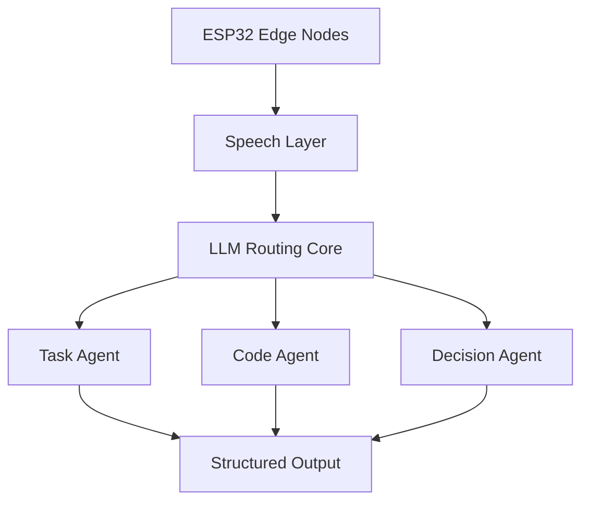

  

---

## 👑 About

Building intelligent systems that connect:

- 🛰 Edge Devices (ESP32)
- 🎙 Real-Time Speech Pipelines
- 🧠 LLM Routing Cores
- 🤖 Autonomous Agent Networks

Palette: **Royal Amethyst × Imperial Topaz × Platinum Mist**.

---

## 🧩 Core Stack

---

## 🚀 Featured Projects

<table>
  <tr>
    <td width="50%">
      
    </td>
    <td width="50%">
      
    </td>
  </tr>
  <tr>
    <td width="50%">
      
    </td>
    <td width="50%">
      
    </td>
  </tr>
</table>

---

## 📊 GitHub Intelligence (Backup cards)

---

## 📈 Activity Network

---

## 🎧 Spotify

---

## 🐍 Contribution Flow (Custom gold/purple)

---

## 🧠 System Architecture

## 📫 Connect

LinkedIn: https://www.linkedin.com/in/serhat-yavuz-70593b370/

X: https://x.com/Arkhino_DEV
