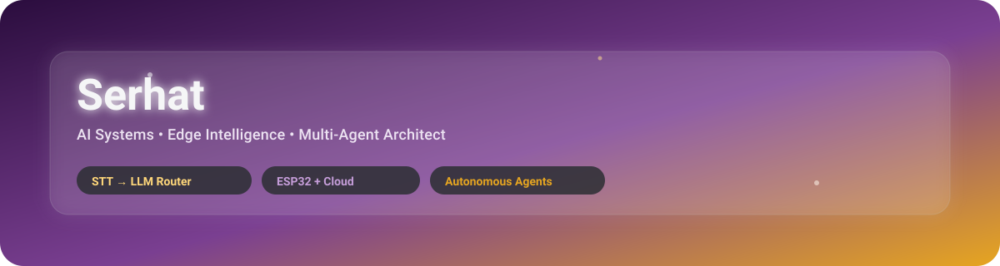
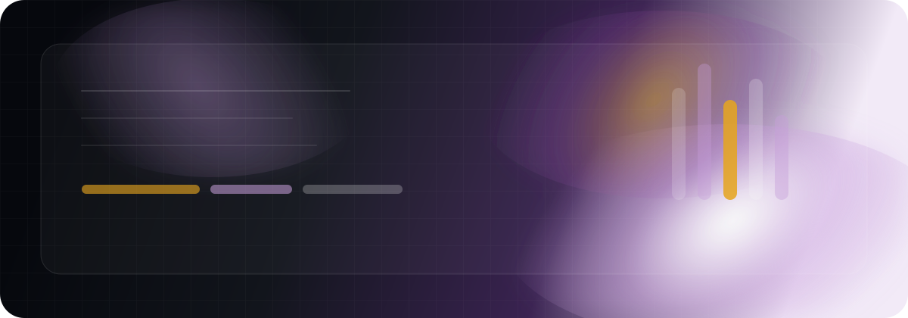
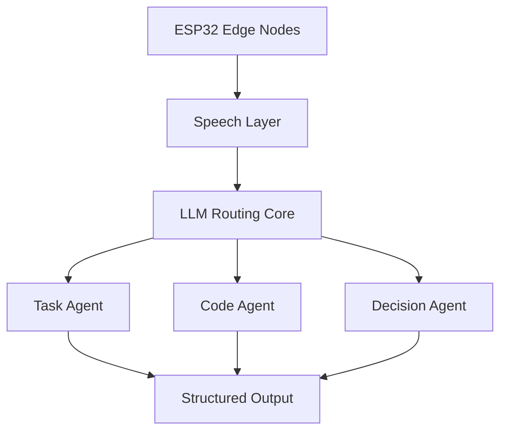

  

  

---

## 👑 About

Building intelligent systems that connect:

- 🛰 Edge Devices (ESP32)
- 🎙 Real-Time Speech Pipelines
- 🧠 LLM Routing Cores
- 🤖 Autonomous Agent Networks

Palette: **Royal Amethyst × Imperial Topaz × Platinum Mist**.

**Experience / Focus:** Edge AI, speech systems, multi-agent orchestration, embedded workflows.

**Pinned Achievement:** Building self-hosted GitHub profile systems with live SVG cards and automation.

---

## 🛠 Currently Building

- Voice-first multi-agent workflows with routing, memory, and tool execution
- ESP32 edge-to-cloud systems for real-time sensing and control
- Self-hosted developer tooling, live SVG cards, and profile automation

**Open To:** internships, research collaborations, and engineering roles focused on AI systems, embedded software, and applied automation.

---

## 🧩 Core Stack

---

## 🚀 Featured Projects

<table>
  <tr>
    <td width="50%">
      
    </td>
    <td width="50%">
      
    </td>
  </tr>
  <tr>
    <td width="50%">
      
    </td>
    <td width="50%">
      
    </td>
  </tr>
</table>

---

## 📊 GitHub Intelligence (Backup cards)

---

## 📈 Activity Network

---

## 🎧 Spotify

---

## 🐍 Contribution Flow (Custom gold/purple)

---

## 🧠 System Architecture

This flow maps how edge devices, speech interfaces, and task-specialized agents connect into a single decision pipeline.

## 📫 Connect

<table>
  <tr>
    <td width="50%">
      
    </td>
    <td width="50%">
      
    </td>
  </tr>
  <tr>
    <td width="50%">
      
    </td>
    <td width="50%">
      
    </td>
  </tr>
</table>
